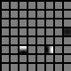
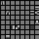
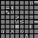
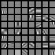
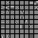
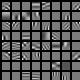
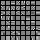
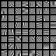
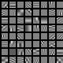

# Reconstruction ICA

Reproducing [Reconstruction ICA](http://ai.stanford.edu/~quocle/LeKarpenkoNgiamNg.pdf), without whitening.

Just run `python main.py`. Will generate a set of weight images with different lambda values.

# sample weights

`lambda=0.4`

`lambda=0.8`

`lambda=1.2`

`lambda=1.6`

`lambda=2.0`

`lambda=2.4`

`lambda=2.8`

`lambda=3.2`

`lambda=3.6`

